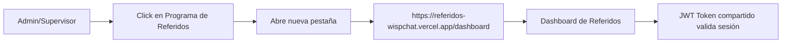
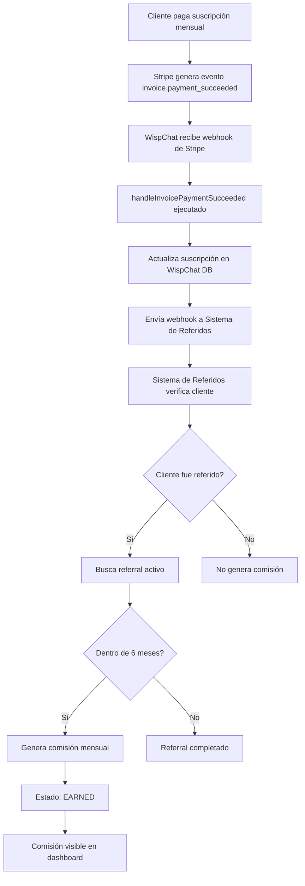

# 🔗 Integración con WispChat - Sistema de Referidos

Este documento describe la integración completa del Sistema de Referidos con WispChat V1.

## 📋 Tabla de Contenidos

1. [Resumen de Integración](#resumen-de-integración)
2. [Cambios en WispChat Frontend](#cambios-en-wispchat-frontend)
3. [Cambios en WispChat Backend](#cambios-en-wispchat-backend)
4. [Flujo de Datos](#flujo-de-datos)
5. [Configuración Requerida](#configuración-requerida)
6. [Pruebas de Integración](#pruebas-de-integración)

---

## 🎯 Resumen de Integración

El Sistema de Referidos se integra con WispChat en dos puntos principales:

### 1. **Frontend - Botón en Panel de Administración**
- Ubicación: Sidebar del panel de administración
- Acceso: Solo para roles `admin` y `supervisor`
- Acción: Abre el dashboard de referidos en nueva pestaña
- Icono: 🎁 (regalo)
- URL: `https://referidos-wispchat.vercel.app/dashboard`

### 2. **Backend - Webhook de Pagos**
- Trigger: Evento `invoice.payment_succeeded` de Stripe
- Acción: Notifica al sistema de referidos para generar comisión mensual
- Endpoint: `POST https://wispchat-referral-backend.onrender.com/api/v1/webhooks/payment-received`
- Autenticación: No requiere (webhook interno)

---

## 🎨 Cambios en WispChat Frontend

### Archivo Modificado: `frontend/app/admin/layout.tsx`

#### 1. Agregar Item al Menú (línea ~90)

```typescript
// Solo admin y supervisor
if (userRole === 'admin' || userRole === 'supervisor') {
  baseItems.push(
    { href: '/admin/departments', label: 'Departamentos', icon: '🏢', roles: ['admin', 'supervisor'] },
    { href: '/admin/agents', label: 'Agentes', icon: '👤', roles: ['admin', 'supervisor'] },
    // ... otros items ...
    
    // 🎁 NUEVO: Programa de Referidos
    { 
      href: 'https://referidos-wispchat.vercel.app/dashboard', 
      label: 'Programa de Referidos', 
      icon: '🎁', 
      roles: ['admin', 'supervisor'], 
      external: true 
    }
  );
}
```

#### 2. Detectar y Manejar Enlaces Externos (línea ~230)

```typescript
<nav className="mt-8 overflow-y-auto h-[calc(100vh-200px)] scrollbar-thin">
  {menuItems.map((item) => {
    const isActive = pathname === item.href || pathname?.startsWith(item.href + '/');
    const isExternal = item.href?.startsWith('http');
    
    // 🔗 Props dinámicos para enlaces externos
    const linkProps = isExternal 
      ? { href: item.href, target: '_blank', rel: 'noopener noreferrer' }
      : { href: item.href };
    
    return (
      <Link
        key={item.href}
        {...linkProps}
        onClick={() => setSidebarOpen(false)}
        className={`flex items-center px-6 py-3 text-sm font-medium transition-colors ${
          isActive
            ? 'border-r-2'
            : 'text-gray-700 hover:bg-gray-50'
        }`}
        // ... resto del código ...
      >
        <span className="mr-3 text-lg">{item.icon}</span>
        {item.label}
      </Link>
    );
  })}
</nav>
```

### Resultado Visual

En el sidebar del panel de administración, los usuarios admin y supervisor verán:

```
📊 Dashboard
💬 Conversaciones
🎫 Tickets
👥 Usuarios
🏢 Departamentos
👤 Agentes
🧠 Conocimiento (IA)
👥 CRM - Clientes
💰 Pagos Pendientes
🔗 Integración WispHub
🔄 Sincronizar Clientes
⚙️ Configuración
🏢 Configuración Empresa
💳 Pagos Automáticos
🎁 Programa de Referidos  ← NUEVO (abre en nueva pestaña)
```

---

## ⚙️ Cambios en WispChat Backend

### Archivo Modificado: `backend/src/controllers/webhookController.ts`

#### 1. Importar Axios (línea ~1)

```typescript
import { Request, Response } from 'express';
import Stripe from 'stripe';
import stripeService from '../services/stripeService';
import prisma from '../config/database';
import axios from 'axios'; // 🆕 NUEVO
```

#### 2. Notificar Sistema de Referidos en Pago Exitoso (línea ~186)

```typescript
async function handleInvoicePaymentSucceeded(invoice: Stripe.Invoice) {
  console.log('💰 [WEBHOOK] Payment succeeded for invoice:', invoice.id);

  const subscriptionId = (invoice as any).subscription;
  if (subscriptionId) {
    const subId = typeof subscriptionId === 'string' ? subscriptionId : subscriptionId.id;
    const subscription = await stripe!.subscriptions.retrieve(subId);
    
    const tenant = await prisma.tenant.findFirst({
      where: { stripeSubscriptionId: subscription.id },
    });

    if (tenant) {
      await stripeService.updateTenantSubscription(tenant.id, subscription);
      console.log(`✅ [WEBHOOK] Subscription renewed for tenant ${tenant.id}`);
      
      // 🎁 NUEVO: Notificar al sistema de referidos
      try {
        const referralWebhookUrl = process.env.REFERRAL_WEBHOOK_URL || 
          'https://wispchat-referral-backend.onrender.com/api/v1/webhooks/payment-received';
        
        await axios.post(referralWebhookUrl, {
          tenantId: tenant.id,
          tenantDomain: tenant.domain,
          invoiceId: invoice.id,
          subscriptionId: subscription.id,
          amount: invoice.amount_paid / 100, // Convert cents to currency
          currency: invoice.currency,
          paymentDate: new Date(invoice.created * 1000).toISOString(),
        }, {
          timeout: 5000,
        });
        
        console.log(`🎁 [WEBHOOK] Referral system notified for tenant ${tenant.id}`);
      } catch (error: any) {
        console.error('❌ [WEBHOOK] Error notifying referral system:', error.message);
        // No interrumpir el flujo principal si falla la notificación
      }
    }
  }
}
```

### Archivo Modificado: `backend/.env`

#### Agregar Variable de Entorno

```bash
# Referral System Integration
REFERRAL_WEBHOOK_URL="https://wispchat-referral-backend.onrender.com/api/v1/webhooks/payment-received"
```

**Nota:** En producción de Render, agregar esta variable en el dashboard de configuración.

---

## 🔄 Flujo de Datos

### Flujo 1: Usuario Accede al Programa de Referidos



**Detalles Técnicos:**
- El JWT token de WispChat es válido en el sistema de referidos
- Ambos sistemas comparten el mismo `JWT_SECRET`
- El token contiene: `{userId, email, role, tenantId, tenantDomain}`
- Si el usuario no está autenticado, se redirige al login de WispChat

---

### Flujo 2: Generación de Comisión Mensual



**Datos Enviados en Webhook:**

```json
{
  "tenantId": "wispchat",
  "tenantDomain": "wispchat.com",
  "invoiceId": "in_1234567890",
  "subscriptionId": "sub_1234567890",
  "amount": 299.00,
  "currency": "mxn",
  "paymentDate": "2024-12-03T10:30:00.000Z"
}
```

**Lógica del Sistema de Referidos:**

1. Recibe webhook con `tenantId` y `tenantDomain`
2. Busca en tabla `Installation` por `wispChatClientId` o `tenantDomain`
3. Si encuentra, obtiene `referralId` asociado
4. Verifica que el referral esté en estado `ACTIVE`
5. Cuenta pagos previos (`commissionCount`)
6. Si `commissionCount < 6`, genera comisión mensual:
   - `type: MONTHLY`
   - `amount: $50` (configurable en `ReferralSettings`)
   - `status: EARNED`
   - `paymentNumber: commissionCount + 1`
7. Si `commissionCount >= 6`, marca referral como `COMPLETED`

---

## 🔧 Configuración Requerida

### 1. Variables de Entorno - WispChat Backend

**Desarrollo (`backend/.env`):**
```bash
REFERRAL_WEBHOOK_URL="http://localhost:4000/api/v1/webhooks/payment-received"
```

**Producción (Render Dashboard):**
```bash
REFERRAL_WEBHOOK_URL="https://wispchat-referral-backend.onrender.com/api/v1/webhooks/payment-received"
```

### 2. JWT Secret Compartido

**Crítico:** Ambos sistemas DEBEN usar el mismo `JWT_SECRET`.

**WispChat Backend (.env):**
```bash
JWT_SECRET="wispchat-secret-key-2024-ultra-secure"
```

**Sistema de Referidos Backend (.env):**
```bash
JWT_SECRET="wispchat-secret-key-2024-ultra-secure"
```

**⚠️ Importante:** En producción, usar el mismo secreto real configurado en Render.

### 3. CORS Configuration

El backend del Sistema de Referidos debe permitir requests desde WispChat frontend:

**`backend/src/app.ts`:**
```typescript
app.use(cors({
  origin: [
    'http://localhost:3000',  // WispChat frontend dev
    'https://wispchat.com',   // WispChat frontend prod
    'https://www.wispchat.com'
  ],
  credentials: true
}));
```

---

## 🧪 Pruebas de Integración

### Test 1: Acceso al Dashboard de Referidos

**Pasos:**
1. Login en WispChat como admin o supervisor
2. Ir a `/admin` (Panel de Administración)
3. Buscar en el sidebar: **🎁 Programa de Referidos**
4. Click en el botón

**Resultado Esperado:**
- Se abre nueva pestaña con `https://referidos-wispchat.vercel.app/dashboard`
- Usuario está automáticamente autenticado (JWT compartido)
- Dashboard muestra datos del usuario actual

**Si falla:**
- Verificar que `JWT_SECRET` sea idéntico en ambos sistemas
- Verificar que el token no haya expirado
- Revisar console del navegador para errores de CORS

---

### Test 2: Generación de Comisión Mensual

**Prerequisitos:**
1. Sistema de Referidos desplegado en producción
2. Cliente referido registrado y con instalación completada
3. Cliente referido con suscripción activa en WispChat

**Pasos:**
1. Simular pago mensual en Stripe (usar Stripe Test Mode)
2. Stripe enviará webhook `invoice.payment_succeeded` a WispChat
3. WispChat procesará el pago y enviará webhook al Sistema de Referidos

**Comando para simular webhook (Stripe CLI):**
```bash
stripe trigger invoice.payment_succeeded
```

**Resultado Esperado:**
1. En logs de WispChat Backend:
   ```
   💰 [WEBHOOK] Payment succeeded for invoice: in_xxx
   ✅ [WEBHOOK] Subscription renewed for tenant wispchat
   🎁 [WEBHOOK] Referral system notified for tenant wispchat
   ```

2. En logs del Sistema de Referidos Backend:
   ```
   💰 [WEBHOOK] Payment received for tenant: wispchat
   🔍 [WEBHOOK] Looking for installation with wispChatClientId
   ✅ [WEBHOOK] Monthly commission #2 generated successfully
   ```

3. En Dashboard de Referidos:
   - Comisión mensual aparece con estado `EARNED`
   - Contador de pagos incrementa (+1)
   - Monto: $50.00 MXN

**Si falla:**
- Verificar que `REFERRAL_WEBHOOK_URL` esté configurada correctamente
- Verificar que el backend del Sistema de Referidos esté activo
- Revisar logs en Render para ambos servicios
- Verificar que el cliente tenga `wispChatClientId` en tabla `Installation`

---

### Test 3: Flujo Completo End-to-End

**Escenario:** Cliente referido genera todas las comisiones

**Pasos:**
1. Crear referido desde dashboard (`/dashboard`)
2. Completar registro en `/register/[shareUrl]`
3. Aprobar referido desde panel admin
4. Programar instalación
5. Marcar instalación como completada
   - **Comisión generada:** $500 (instalación)
6. Simular 6 pagos mensuales consecutivos con Stripe
   - **Comisión #1:** $50
   - **Comisión #2:** $50
   - **Comisión #3:** $50
   - **Comisión #4:** $50
   - **Comisión #5:** $50
   - **Comisión #6:** $50
7. Verificar que referral cambie a estado `COMPLETED`

**Resultado Final:**
- **Total comisiones:** $500 + ($50 × 6) = $800 MXN
- **Estado referral:** `COMPLETED`
- **Pagos contados:** 6/6
- **Todas las comisiones:** Estado `EARNED`

---

## 🔒 Consideraciones de Seguridad

### 1. Webhook Authentication

El webhook entre WispChat y Sistema de Referidos NO requiere autenticación porque:
- Es comunicación servidor-a-servidor (backend-to-backend)
- No expone datos sensibles del usuario
- Usa IDs públicos de Stripe
- Timeout de 5 segundos previene DoS

**Mejora Futura:** Implementar firma HMAC o API Key compartido.

### 2. JWT Token Security

- Token expira en 24 horas (configurable)
- Refresh token para renovación automática
- Secreto debe ser de al menos 32 caracteres
- Nunca exponer `JWT_SECRET` en frontend

### 3. CORS Policy

Solo permitir origins confiables:
```typescript
origin: [
  process.env.FRONTEND_URL,
  'https://wispchat.com'
]
```

---

## 📊 Monitoreo y Logs

### Logs Clave en WispChat Backend

```bash
# Pago exitoso
💰 [WEBHOOK] Payment succeeded for invoice: in_xxx

# Notificación al sistema de referidos
🎁 [WEBHOOK] Referral system notified for tenant wispchat

# Error al notificar (no interrumpe flujo)
❌ [WEBHOOK] Error notifying referral system: Connection timeout
```

### Logs Clave en Sistema de Referidos

```bash
# Recepción de webhook
💰 [WEBHOOK] Payment received for tenant: wispchat

# Búsqueda de instalación
🔍 [WEBHOOK] Looking for installation with wispChatClientId: client_123

# Generación de comisión
✅ [WEBHOOK] Monthly commission #3 generated successfully

# Sin instalación encontrada
⚠️ [WEBHOOK] No installation found for tenant: wispchat
```

---

## 🚀 Despliegue

### Orden de Despliegue Recomendado

1. **Sistema de Referidos Backend** (Render)
   - Deploy primero para tener URL activa
   - Configurar PostgreSQL
   - Aplicar migraciones
   - Ejecutar seed (tenant wispchat)

2. **Sistema de Referidos Frontend** (Vercel)
   - Configurar `NEXT_PUBLIC_API_URL` con URL de Render
   - Deploy

3. **WispChat Backend**
   - Agregar `REFERRAL_WEBHOOK_URL` en Render
   - Redeploy para aplicar cambios

4. **WispChat Frontend**
   - Código ya tiene el botón integrado
   - Redeploy si es necesario

---

## 📞 Soporte y Troubleshooting

### Problema: Botón no aparece en sidebar

**Solución:**
- Verificar que el usuario tenga rol `admin` o `supervisor`
- Limpiar cache del navegador
- Verificar que frontend esté en última versión

### Problema: Webhook no llega al Sistema de Referidos

**Solución:**
- Verificar que `REFERRAL_WEBHOOK_URL` esté configurada
- Verificar que backend de Referidos esté activo (check `/health`)
- Revisar logs de Render para errores de red
- Verificar firewall o security groups

### Problema: Comisión no se genera

**Solución:**
- Verificar que cliente tenga `wispChatClientId` en tabla `Installation`
- Verificar que referral esté en estado `ACTIVE`
- Verificar que no haya superado 6 pagos
- Revisar logs del webhook para errores

---

## ✅ Checklist de Integración

- [ ] Botón agregado al sidebar de WispChat admin
- [ ] Enlaces externos abren en nueva pestaña
- [ ] Axios importado en webhookController.ts
- [ ] Webhook agregado a handleInvoicePaymentSucceeded
- [ ] REFERRAL_WEBHOOK_URL configurada en .env
- [ ] JWT_SECRET idéntico en ambos sistemas
- [ ] CORS configurado para permitir WispChat origin
- [ ] Test de acceso al dashboard exitoso
- [ ] Test de generación de comisión exitoso
- [ ] Logs de monitoreo funcionando
- [ ] Sistema desplegado en producción
- [ ] Documentación actualizada

---

## 🎉 Conclusión

La integración entre WispChat y el Sistema de Referidos está diseñada para ser:

- **Transparente:** Usuario admin/supervisor accede fácilmente desde el panel
- **Automática:** Comisiones se generan sin intervención manual
- **Confiable:** Error en webhook no interrumpe pagos de WispChat
- **Segura:** JWT compartido valida identidad del usuario
- **Escalable:** Soporta múltiples tenants y configuraciones personalizadas

Para más información, consultar:
- [README.md](./README.md) - Documentación general del sistema
- [DEPLOYMENT_GUIDE.md](./DEPLOYMENT_GUIDE.md) - Guía de despliegue
- [RESUMEN_EJECUTIVO.md](./RESUMEN_EJECUTIVO.md) - Resumen ejecutivo del proyecto

---

**Última actualización:** 3 de diciembre de 2024  
**Versión:** 1.0.0  
**Autor:** Sistema de Desarrollo WispChat
