# 🚀 GUÍA RÁPIDA DE DESPLIEGUE EN PRODUCCIÓN

## 📊 Estado Actual

✅ **Sistema Completo y Listo para Producción**

### Código Completado
- ✅ Backend API (Node.js + Express + Prisma + PostgreSQL)
- ✅ Frontend Web (Next.js 14 + Tailwind CSS)
- ✅ Integración con WispChat (Frontend + Backend)
- ✅ Configuraciones de despliegue (Render + Vercel)
- ✅ Migraciones de base de datos
- ✅ Documentación completa

### Commits Realizados
```
wispchat-referral-system:
- 4f9a00e: feat: WispChat Referral System MVP complete
- b452b2a: docs: add executive summary  
- 5f15e47: feat: production deployment ready
- f150fa5: docs: add comprehensive WispChat integration guide

WispChatV1:
- e02217d: feat: integrate referral system with WispChat
```

---

## 🎯 Pasos para Desplegar

### PASO 1: Subir Código a GitHub (5 minutos)

```bash
cd /home/easyaccess/projects/wispchat-referral-system
./github-setup.sh
```

El script te guiará para:
1. Crear repositorio en GitHub: https://github.com/new
2. Conectar repositorio local
3. Push a GitHub

**Alternativa Manual:**
```bash
# 1. Crear repo en GitHub: wispchat-referral-system
# 2. Ejecutar:
git remote add origin https://github.com/{tu-usuario}/wispchat-referral-system.git
git branch -M main
git push -u origin main
```

---

### PASO 2: Desplegar Backend en Render (10 minutos)

#### 2.1 Crear Base de Datos PostgreSQL

1. Ve a https://dashboard.render.com
2. Click **New +** → **PostgreSQL**
3. Configuración:
   - **Name:** `wispchat-referral-db`
   - **Database:** `wispchat_referral`
   - **User:** (auto-generado)
   - **Region:** Oregon (US West)
   - **Plan:** Free
4. Click **Create Database**
5. **Espera 2-3 minutos** a que esté disponible
6. Copia el **Internal Database URL** (empieza con `postgresql://`)

#### 2.2 Desplegar Backend Web Service

1. Click **New +** → **Web Service**
2. Conectar GitHub repository: `wispchat-referral-system`
3. Configuración:
   - **Name:** `wispchat-referral-backend`
   - **Region:** Oregon (US West)
   - **Branch:** `main`
   - **Root Directory:** `backend`
   - **Runtime:** Node
   - **Build Command:** `npm install && npm run build && npx prisma generate`
   - **Start Command:** `npm start`
   - **Plan:** Free

4. **Variables de Entorno** (Environment):
   ```bash
   NODE_ENV=production
   PORT=10000
   DATABASE_URL={PEGA_AQUI_INTERNAL_DATABASE_URL}
   JWT_SECRET=wispchat-secret-key-2024-ultra-secure
   FRONTEND_URL=https://referidos-wispchat.vercel.app
   ```

5. Click **Create Web Service**
6. **Espera 5-7 minutos** al primer despliegue

#### 2.3 Aplicar Migraciones

Una vez desplegado:

1. Ve a **Shell** en el dashboard de Render
2. Ejecuta:
   ```bash
   npx prisma migrate deploy
   npx prisma db seed
   ```

3. Verifica que todo funciona:
   ```bash
   curl https://wispchat-referral-backend.onrender.com/health
   ```
   Debe responder: `{"status":"ok","timestamp":"..."}`

---

### PASO 3: Desplegar Frontend en Vercel (5 minutos)

#### 3.1 Importar Proyecto

1. Ve a https://vercel.com/new
2. Click **Import Git Repository**
3. Conectar GitHub repository: `wispchat-referral-system`
4. Configuración:
   - **Project Name:** `referidos-wispchat`
   - **Framework Preset:** Next.js
   - **Root Directory:** `frontend`
   - **Build Command:** (detectado automáticamente)
   - **Output Directory:** `.next`

#### 3.2 Configurar Variables de Entorno

```bash
NEXT_PUBLIC_API_URL=https://wispchat-referral-backend.onrender.com/api/v1
```

#### 3.3 Desplegar

1. Click **Deploy**
2. **Espera 3-5 minutos**
3. URL final: `https://referidos-wispchat.vercel.app`

---

### PASO 4: Configurar WispChat Backend (2 minutos)

#### 4.1 Agregar Variable de Entorno en Render

1. Ve al dashboard de WispChat Backend en Render
2. Settings → Environment
3. Agregar:
   ```bash
   REFERRAL_WEBHOOK_URL=https://wispchat-referral-backend.onrender.com/api/v1/webhooks/payment-received
   ```
4. Click **Save Changes**
5. Render redesplegará automáticamente

#### 4.2 Redeploy WispChat Frontend (si es necesario)

Si el frontend de WispChat no se actualiza automáticamente:

```bash
cd /home/easyaccess/projects/WispChatV1
git push origin main  # Trigger redeploy en Vercel/Render
```

---

## ✅ Verificación de Despliegue

### Test 1: Backend Health Check

```bash
curl https://wispchat-referral-backend.onrender.com/health
```

**Respuesta esperada:**
```json
{
  "status": "ok",
  "timestamp": "2024-12-03T10:30:00.000Z",
  "database": "connected"
}
```

---

### Test 2: Frontend Accesible

1. Abre: https://referidos-wispchat.vercel.app
2. Debe cargar la landing page
3. Click en **Registrarse** → debe mostrar error (necesitas shareUrl válido)

---

### Test 3: Botón en WispChat Admin

1. Login en WispChat como admin o supervisor
2. Ve a `/admin`
3. Busca en el sidebar: **🎁 Programa de Referidos**
4. Click → debe abrir dashboard de referidos en nueva pestaña

---

### Test 4: Crear Primer Referido

1. Ve al dashboard de referidos (desde WispChat admin)
2. Click **Nuevo Referido**
3. Llena el formulario:
   - Nombre: Juan Pérez
   - Email: juan.perez@test.com
   - Teléfono: +52 555 123 4567
   - Paquete deseado: 100 Mbps
4. Click **Crear Referido**
5. Debe aparecer en la lista con estado **PENDIENTE**
6. Copia el **Link de Registro**

---

### Test 5: Registro Público

1. Abre el link de registro (copiado del paso anterior)
2. Completa los 3 pasos:
   - **Paso 1:** Confirmar información
   - **Paso 2:** Subir INE y comprobante de domicilio
   - **Paso 3:** Confirmación
3. Debe mostrar: "¡Registro Completado!"

---

### Test 6: Aprobar Referido (Admin)

1. Vuelve al dashboard de referidos
2. Busca el referido recién registrado
3. Click en **Detalles**
4. Debe mostrar documentos subidos
5. Click **Aprobar Referido**
6. Estado cambia a **APROBADO**

---

### Test 7: Programar Instalación

**Endpoint POST:**
```bash
curl -X POST https://wispchat-referral-backend.onrender.com/api/v1/installations \
  -H "Authorization: Bearer {TU_JWT_TOKEN}" \
  -H "Content-Type: application/json" \
  -d '{
    "referralId": "{ID_DEL_REFERIDO}",
    "scheduledDate": "2024-12-10T10:00:00.000Z",
    "address": "Calle Falsa 123, Col. Centro"
  }'
```

**Respuesta esperada:**
```json
{
  "success": true,
  "data": {
    "id": "inst_xxx",
    "status": "SCHEDULED",
    "scheduledDate": "2024-12-10T10:00:00.000Z"
  }
}
```

---

### Test 8: Completar Instalación

**Endpoint PATCH:**
```bash
curl -X PATCH https://wispchat-referral-backend.onrender.com/api/v1/installations/{INSTALLATION_ID}/complete \
  -H "Authorization: Bearer {TU_JWT_TOKEN}" \
  -H "Content-Type: application/json" \
  -d '{
    "wispHubClientId": 12345,
    "wispChatClientId": "client_abc123",
    "contractNumber": "CONT-2024-001"
  }'
```

**Resultado:**
- ✅ Instalación marca como **COMPLETADA**
- ✅ Referido cambia a **ACTIVO**
- ✅ **Comisión de instalación generada:** $500 MXN (EARNED)

---

### Test 9: Simular Pago Mensual (Webhook)

**Endpoint POST (desde WispChat):**
```bash
curl -X POST https://wispchat-referral-backend.onrender.com/api/v1/webhooks/payment-received \
  -H "Content-Type: application/json" \
  -d '{
    "tenantId": "wispchat",
    "tenantDomain": "wispchat.com",
    "invoiceId": "in_test_123",
    "subscriptionId": "sub_test_123",
    "amount": 299.00,
    "currency": "mxn",
    "paymentDate": "2024-12-03T10:00:00.000Z"
  }'
```

**Resultado:**
- ✅ Sistema busca instalación con `wispChatClientId`
- ✅ Genera **comisión mensual:** $50 MXN (EARNED)
- ✅ Contador de pagos incrementa (+1)
- ✅ Comisión visible en dashboard

---

## 🔄 Flujo Completo de Producción

```mermaid
graph TD
    A[Admin crea referido] --> B[Copia link de registro]
    B --> C[Cliente completa registro + docs]
    C --> D[Admin aprueba referido]
    D --> E[Admin programa instalación]
    E --> F[Técnico completa instalación]
    F --> G[Comisión $500 generada]
    G --> H[Cliente activo en WispChat]
    H --> I[Cliente paga mensualidad]
    I --> J[WispChat recibe pago de Stripe]
    J --> K[WispChat envía webhook a Sistema Referidos]
    K --> L[Comisión $50 generada]
    L --> M{Pagos < 6?}
    M -->|Sí| I
    M -->|No| N[Referido COMPLETADO]
    N --> O[Total: $800 en comisiones]
```



---

## 📊 Monitoreo Post-Despliegue

### Logs en Render (Backend)

1. Ve a dashboard de Render
2. Click en `wispchat-referral-backend`
3. Tab **Logs**

**Logs importantes:**
```bash
✅ [SERVER] Running on port 10000
✅ [DB] Connected to PostgreSQL
💰 [WEBHOOK] Payment received for tenant: wispchat
✅ [WEBHOOK] Monthly commission #3 generated successfully
```

---

### Logs en Vercel (Frontend)

1. Ve a dashboard de Vercel
2. Click en `referidos-wispchat`
3. Tab **Functions** → **Logs**

**Logs importantes:**
```bash
✅ Page /dashboard rendered successfully
✅ API call to /api/v1/referrals successful
```

---

### Logs en WispChat Backend (Render)

**Buscar:**
```bash
🎁 [WEBHOOK] Referral system notified for tenant wispchat
```

Si ves este log, la integración funciona correctamente.

---

## 🔧 Troubleshooting

### Problema: Backend no responde en `/health`

**Solución:**
```bash
# Verificar logs en Render
# Buscar errores de conexión a DB
# Verificar que DATABASE_URL esté correcta
# Reiniciar servicio en Render
```

---

### Problema: Frontend muestra "Network Error"

**Solución:**
```bash
# Verificar NEXT_PUBLIC_API_URL en Vercel
# Debe ser: https://wispchat-referral-backend.onrender.com/api/v1
# Redeploy en Vercel
```

---

### Problema: CORS Error al hacer requests

**Solución:**
```bash
# Verificar FRONTEND_URL en backend env
# Debe incluir: https://referidos-wispchat.vercel.app
# Redeploy backend en Render
```

---

### Problema: Webhook no genera comisiones

**Solución:**
1. Verificar que `wispChatClientId` esté en tabla `Installation`
2. Verificar logs del webhook en Render
3. Simular webhook manualmente con curl (ver Test 9)
4. Verificar que referral esté en estado `ACTIVE`

---

## 📞 URLs Finales

### Sistema de Referidos
- **Frontend:** https://referidos-wispchat.vercel.app
- **Backend API:** https://wispchat-referral-backend.onrender.com/api/v1
- **Health Check:** https://wispchat-referral-backend.onrender.com/health

### WispChat (sin cambios)
- **Frontend:** [URL de producción actual]
- **Backend API:** [URL de producción actual]

---

## 🎉 ¡Despliegue Completo!

Si todos los tests pasan, el sistema está **100% funcional en producción**.

### Próximos Pasos Opcionales

1. **Dominio Personalizado:**
   - Configura `referidos.wispchat.net` en Vercel
   - Agrega DNS CNAME record

2. **Alertas de Monitoreo:**
   - Configurar Render alerts
   - Configurar Vercel alerts

3. **Panel de Administración:**
   - Implementar páginas de admin (Fase 2)
   - Gestión de configuración de comisiones
   - Reportes y estadísticas avanzadas

4. **Backup de Base de Datos:**
   - Configurar backups automáticos en Render
   - Política de retención

---

## 📚 Documentación

- **README.md:** Documentación general del sistema
- **DEPLOYMENT_GUIDE.md:** Guía completa de despliegue (645 líneas)
- **INTEGRACION_WISPCHAT.md:** Guía de integración con WispChat
- **RESUMEN_EJECUTIVO.md:** Resumen ejecutivo del proyecto

---

**¡Todo listo para producción!** 🚀

Si tienes alguna duda durante el despliegue, consulta las guías detalladas o revisa los logs en Render/Vercel.

---

**Última actualización:** 3 de diciembre de 2024  
**Versión del Sistema:** 1.0.0  
**Estado:** Production Ready ✅
